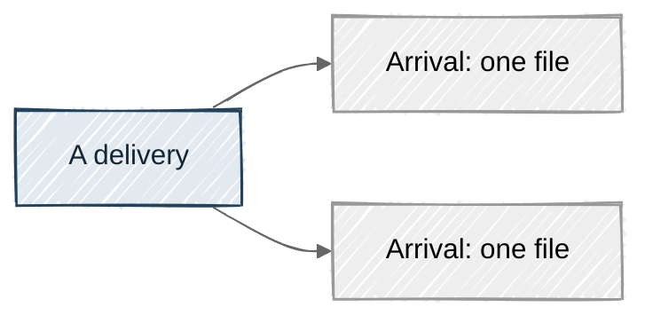

# House standard for Mothman's documentation

## How to use this standard

This file is the one copy of the house rules for Mothman's documentation. docs-writer, docs-illustrator, and docs-fact-checker preload it.

They also preload the reader-judgement skill, docs-reader-judgement. That skill holds the rules a reader judges a finished page by. Every rule lives in one of the 2 files, never in both.

The baseline is GOV.UK's writing guidance, at guidance.publishing.service.gov.uk. Where this file says nothing, follow GOV.UK.

Two markers appear on rules:

- "(Keith)" marks a rule that is not in GOV.UK's guidance. It is Keith's own, layered on top. Where it differs from GOV.UK, it wins.
- A rule id in square brackets, such as [V-semicolon], marks a rule that `mothman docs validate` enforces. A page that breaks it fails before any reviewer reads it.

A rule with no "(Keith)" marker comes from GOV.UK.

The glossary, docs/explainers/glossary.yaml, is the one source for how every Mothman term is spelled. This file holds no copy of it.

Keith approves the exact wording of any rule added, removed, renumbered, or reworded here, before the edit is made.

## Part 1. Rules for every document type

Part 1 applies to every document type. Part 2 adds the rules for explanations. A later document type, such as the how-to guides planned for Running Mothman, gets its own part beside Part 2.

### Where the prose rules apply

The prose rules apply to headings, body text, list items, table cells, the 'In short' box, and diagram captions. They do not apply to front matter, Mermaid source, the build-state block and heading markers, or the 'where this comes from' list.

The validator counts sentences and words this way:

- A sentence is a run of prose that ends in a full stop, question mark, or exclamation mark. That mark is followed by whitespace or the end of its block. The end of a heading, list item, table cell, or caption also ends a sentence.
- A word is a whitespace-separated token that holds at least one letter or digit. So a spaced en dash is not a word, and a hyphenated compound is one word.

### Spelling and punctuation

- Use Australian spelling. (Keith)
- Use the Oxford comma in every list of 3 or more items: "red, amber, and green". (Keith)
- Mark a break in a sentence with a spaced en dash ( – ). Never use an em dash, an en dash without a space on both sides, or a spaced hyphen as a dash. (Keith) [V-dash]
- Do not use semicolons. Write 2 sentences instead. [V-semicolon]
- Do not use eg, ie, or etc, in any spelling. Write "for example" or "that is", and name every item rather than trailing off. [V-latin-abbreviation]
- Do not use negative contractions. Write "cannot", "do not", and "is not" in full. Positive contractions such as "you'll", "it's", and "we're" are fine. [V-negative-contraction]

### Sentences and paragraphs

- Aim for sentences of 15 to 20 words. (Keith)
- Keep every sentence to 25 words or fewer. A heading is exempt, because a heading is not a sentence. Every other prose rule still applies to headings. [V-sentence-length]
- Keep every paragraph to 5 sentences or fewer. [V-paragraph-length]
- Write prose first. Use a list only for a real set, such as the 8 filing decisions. (Keith)

### Dates, times, numbers, and ranges

- Write a date in the form 29 September 2026.
- Write a time as 11:59pm, never as "midnight", which leaves the reader unsure which day is meant. [V-midnight]
- Use "to" in a range: "500 to 800 words", "1 February to 30 April 2026". Never join 2 numbers or 2 dates with a hyphen or a dash. [V-range-dash]
- A period name such as 2026-Q3 is a Mothman term, not a range, and the validator accepts it.
- Write "one" in words, unless it is a step or a point in a list. Use numerals for every other number, including 2 to 9.

### Headings and titles

- Write headings and page titles as statements, never as questions. No heading ends in a question mark. [V-question-heading]

### Words

- Never use a word or phrase on the banned lists in the house rules block below. The lists have 4 categories: AI-voice words, condescension, corporate filler, and fixed-phrase rhetorical tics. (Keith) [V-banned-phrase]
- Some words are fine once but read as AI writing when they gather. They are on the watch list in the house rules block below. Never use 2 or more of them in one paragraph, list item, or heading. (Keith) [V-banned-cluster]
- The validator matches each banned entry as a whole word or phrase, in any letter case. A match inside a phrase on the exemption list passes.
- Only Keith adds an exemption, as a change to this standard. A page never carries an override of its own.
- Rhetorical tics that take a pattern rather than a fixed phrase are for a reader to judge. The reader-judgement skill holds them.
- GOV.UK keeps 2 lists of words to avoid, one in its A to Z and one in its Technical A to Z. Avoid every word on both that no banned list already catches.
- From the A to Z, avoid agenda, advance, collaborate, combat, commit, pledge, counter, deploy, dialogue, drive, and focus.
- Also avoid foster, impact, initiate, key, land, progress, strengthening, tackle, transform, hub, portal, and ring fencing.
- From the Technical A to Z, avoid action, allow, consult, detail as a verb, enable, ensure, examine, fulfil, inform, and interrogate.
- Also avoid periodically, refer to, regularly, requires, should the, take place, and underlying.
- Several are fine in a literal sense, such as a foster carer, a software deployment, or a key that unlocks something. Follow GOV.UK's own sense for each.
- Four of GOV.UK's words to avoid are Mothman terms: promote, deliver, asset, and issue. Use each freely in its glossary sense. Everywhere else, follow GOV.UK and write "problems" rather than "issues", for example. (Keith)

### Terms and the glossary

- Spell every Mothman term exactly as its canonical entry in docs/explainers/glossary.yaml spells it. (Keith)
- On a term's first use on a page, make it bold and define it in one plain clause in the same sentence. Also link it to its glossary entry. Later uses are plain text. (Keith)
- Use bold for nothing else. Bold always means "this is a defined term". (Keith)
- Explain a specialist term rather than avoiding it.
- No heading may use a Mothman term before the page has defined it.
- The page title may name the page's own concept before it is defined. (Keith)
- Write status names in lowercase plain text: "the dataset turns red", "an amber supply". (Keith)
- Give a named period its due date on first use on each page: "the 2026-Q3 period (supply due 1 August 2026)". After that, write "2026-Q3" alone. Mothman's quarterly periods are not calendar quarters, so months would mislead. (Keith)

### Links and safe content

- In the body, link only to another file inside docs/explainers/, by a relative path, with or without an anchor. Never link into docs/explainers/_work/. (Keith) [V-link-target]
- In the 'where this comes from' list, link each source by a relative path to the committed file it names. A requirement id links to requirements.yaml. Never link into data/, reports/, or docs/explainers/_work/. (Keith) [V-link-target]
- Never write a URL of any kind, not even as plain text. Anything of the form scheme:// counts, and so does a bare //. That catches a database address too, and every javascript: or data: link. (Keith) [V-external-url]
- Write only .md and .yaml files. (Keith) [V-file-type]
- Never write raw HTML of any kind, including a comment. (Keith) [V-raw-html]
- Never include an image. Every picture is a Mermaid diagram. (Keith) [V-image]
- Never include a zero-width or bidirectional-control character. The validator checks this skill file, the reader-judgement skill, and the docs agents' definitions for them too. (Keith) [V-hidden-character]

### Diagrams

- Draw every diagram in Mermaid, in a fenced block with the info string mermaid. (Keith)
- Every block must parse in Mermaid 11.17, the version GitHub renders. (Keith) [V-mermaid-parse]
- State the look and the theme explicitly in every block's config. (Keith) [V-mermaid-config]
- Use the theme neutral. It is provisional, until it has been checked on GitHub in light and dark mode. (Keith)
- Use the hand-drawn look, handDrawn, only on flowchart, state, class, and ER diagrams. Use the plain look, classic, on every other type. (Keith) [V-hand-drawn-type]
- Where the right shape for an idea is one the hand-drawn look does not support, draw that shape in the plain look. A timeline is the usual case. Never bend a supported type to fit. (Keith)
- Set handDrawnSeed to the house seed, hand_drawn_seed in the house rules block, on every hand-drawn block. Leave it out of a plain block. (Keith) [V-hand-drawn-seed]
- Give every classDef a fill, a stroke, and a text colour, all taken from the palette in the house rules block. (Keith)
- Make every diagram still make sense in the plain look, because GitHub chooses its own Mermaid version and could change it. (Keith)
- Never use a click directive, or any directive that touches securityLevel. (Keith) [V-mermaid-directive]
- The caption is the first non-blank line after the block's closing fence. Write it wholly in italics, as one sentence that states the diagram's takeaway. (Keith) [V-caption]
- Copy the caption's text into the block as both its accTitle and its accDescr, without the italic markers. The validator compares them after normalising whitespace. (Keith) [V-caption-accessible]

The reader-judgement skill holds the tests a diagram must pass to earn its place.

This is the shape of a hand-drawn block and its caption:

````markdown


*One delivery can hold several arrivals, and each arrival is one file.*
````

### House rules as data

The validator reads this block directly. It holds the banned lists, the watch list, the exemptions, the house seed, and the diagram palette.

The palette is provisional. It is drawn from the dashboard's own colours, as pale fills with dark text and a darker stroke. Each classDef has one set of colours for both modes. A pale node reads on a dark page, and its stroke carries it on a light one. Every text colour reaches at least 12.7 to 1 contrast against its fill. It still needs checking on GitHub in light and dark mode before it stops being provisional.

```yaml house-rules
hand_drawn_seed: 42

# Provisional. Hex colours for classDef fill, stroke, and text (Mermaid's color).
palette:
  neutral: {fill: "#EEEADD", stroke: "#5B6058", text: "#1B2420"}
  accent:  {fill: "#E3EAEF", stroke: "#23425C", text: "#132635"}
  good:    {fill: "#E1EFDD", stroke: "#036819", text: "#1B2420"}
  warn:    {fill: "#FBF1D8", stroke: "#8A6A00", text: "#1B2420"}
  bad:     {fill: "#F7E1E1", stroke: "#9A1C2E", text: "#1B2420"}
  change:  {fill: "#F0E7F7", stroke: "#6B3FA0", text: "#1B2420"}

# Whole words and phrases, matched in any letter case.
banned:
  ai_voice:
    - delve
    - delves
    - delving
    - tapestry
    - leverage
    - leveraging
    - seamless
    - seamlessly
    - "it's worth noting"
    - "it is worth noting"
    - pivotal
    - realm
    - embark
    - holistic
    - game-changer
    - cutting-edge
    - "a testament to"
    - "in today's"
    - "at its core"
    - intricate
    - "serves as"
    - "stands as"
  condescension:
    - just
    - simply
    - easy
    - easily
    - obviously
    - "of course"
  corporate_filler:
    - utilise
    - utilize
    - utilisation
    - facilitate
    - "going forward"
    - "moving forward"
    - "in order to"
    - synergy
    - synergies
    - empower
    - liaise
    - overarching
    - streamline
    - "slim down"
    - "one-stop shop"
    - incentivise
    - disincentivise
  rhetorical_tics:
    - "here's the thing"
    - "here is the thing"
    - "let's dive in"
    - "dive into"
    - "deep dive"
    - "let's unpack"
    - "buckle up"
    - "make no mistake"
    - "at the end of the day"
    - "the bottom line"
    - "spoiler alert"

# Fine alone. Two or more matches in one paragraph, list item, or heading fail.
watch:
  - crucial
  - robust
  - landscape
  - underscore
  - underscores
  - underscored
  - enhance
  - enhances
  - enhanced
  - enhancing
  - quick
  - simple

# A banned match that falls wholly inside one of these phrases passes.
exemptions:
  - phrase: just-in-time
    reason: A fixed technical term, not the condescending "just".
  - phrase: promote
    reason: A Mothman term in its glossary sense. Not banned today. Listed so a later list change cannot catch it.
  - phrase: deliver
    reason: A Mothman term in its glossary sense. Not banned today. Listed so a later list change cannot catch it.
  - phrase: asset
    reason: A Mothman term in its glossary sense. Not banned today. Listed so a later list change cannot catch it.
  - phrase: issue
    reason: A Mothman term in its glossary sense. Not banned today. Listed so a later list change cannot catch it.
```

## Part 2. Rules for explanations

An explanation is a concept page or a group page under docs/explainers/. It says what a Mothman idea means and why it is that way.

### Voice

- Sound like a senior colleague at a whiteboard, explaining to a smart new hire over coffee. Be warm, lightly playful, precise, and happy to admit where something is fiddly. (Keith)
- Call the reader "you". Use "we" for a choice the project made: "we chose this because". (Keith)
- Take the reader voice of CHANGELOG.yaml's What's New entries as the model. Take the dense, caveat-heavy internal prose of plans/*.md and CLAUDE.md as the thing not to sound like. (Keith)

### The exemplars and the 12 traits

Keith named 4 exemplars: Julia Evans, the GDS blogs, Bartosz Ciechanowski, and Stripe and Monzo's engineering writing. Each works in a different way. The 12 traits below paraphrase what makes them work. Never quote, excerpt, or link their text, and never imitate one voice. (Keith)

The traits work inside every other rule in this standard. They are already worded to fit the page parts.

1. Open on a small moment. After the 'In short' box, open the body on a small moment from a dataset's life, where someone in the cast notices something odd. The next sentence says why it matters. (Keith)
2. Put the news first. Straight after that opening, say what the concept does and who it affects, before any background. (Keith)
3. Build from the naive version. Show the plainest approach that almost works, name its one flaw, then show the concept fixing it. At this length, that means one or 2 steps, not 5. (Keith)
4. Show the thing, then name it. In the body, let the reader see what a term refers to before you name it. Then bold, define, and link it, as the terms rule says. (Keith)
5. Pin down slippery words. Where a word has an everyday sense and a Mothman sense, give each sense with a one-line way to tell them apart. Say what the concept is not. (Keith)
6. Set up every diagram and read it back. The sentence before a diagram says what to look at and what its colours or shapes mean. The sentence after it gives the one thing to notice. The caption states the takeaway in the caption form above, and supplies the accTitle and accDescr. (Keith)
7. Use real, checked examples, never "Dataset X". Real examples come only from committed configuration: period names, due dates, and dataset and table names. Any example row is invented, and unmistakably synthetic. (Keith)
8. List the cases, then come back to them. When a concept handles several cases, list them early. Once the concept is in place, walk back through the same list. (Keith)
9. Admit a simplification in one plain sentence, where it happens. Correct an earlier loose sentence openly. Do not hedge every sentence. (Keith)
10. Keep an analogy to one idea, then drop it. The cast carries the continuity, and the analogy does not. (Keith)
11. Let warmth come from the cast, small stakes, and plain friendliness, not from punctuation. Keep wry asides to body text. A section heading or page title may carry a gentle turn of phrase, but never a pun. Nothing playful goes in a definition. (Keith)
12. End small and useful. Give a recap of 2 or 3 short, parallel statements. Then give one pointer to where to look next, such as a related page or a dashboard view. Both sit immediately before the 'where this comes from' list, which stays last. Add no closing flourish. (Keith)

### What we do not take from the exemplars

Do not adopt these habits, even though the exemplars use them. (Keith)

- Negative contractions. Positive ones such as "you'll" are fine.
- Question headings, and headings that start in lower case.
- Exclamation marks, capitals for emphasis, emoticons, and emoji.
- A first-person singular narrator. The voice is the house voice, plus the cast.
- Long, extended analogies.
- Interactive figures and article-scale length. We keep only the step-by-step build and the diagram set-up and read-back.
- Maths notation, beyond one short relation stated in words.
- Marketing or hiring endings.
- Abstract institutional policy language.
- Semicolons, and long chains of clauses.
- Unsourced statistics to set a scene. Use only numbers the system itself can confirm.

### The cast

The same small cast appears in every story, so readers get to know them. The overview page's one-supply journey introduces them. (Keith)

Every difficulty in a description or a story comes from the situation, never from a shortcoming in the person. (Keith)

- Priya, data steward at a supplying agency. She sends the supplies. Trait: organised, and proud of her data. Tested when her agency's systems change and a supply arrives looking different from last time. She shows deliveries, calendars, and lateness from the supplier's side. (Keith)
- Sam, data engineer, new to the asset team, and the reader's stand-in. Sam knows government data: SQL, pipelines, data quality, and how agencies, collections, and data-sharing agreements work. Before Mothman, quality assurance meant a hand-written Python script for each dataset and a Word report compiled by hand. Sam has heard of dbt and Great Expectations, but only vaguely. Trait: curious, and always asking why. Tested when a check result or a filing decision disagrees with the old per-dataset scripts, and Sam has to work out which is right. Sam asks the questions the pages answer. (Keith)
- Leah, senior data engineer on the asset team. She has watched the pipeline run across many periods and met every shape of data quality problem. Trait: calm, and her judgement is the benchmark. Tested when a supply brings a mix of problems she has not seen before and the rules cover only half of it. She explains promotion, rejection, holds, and substitutes, often by telling Sam what she saw last time. (Keith)
- The Squirrel, manager of the asset team, and the voice of the 'In short' box. He knows data really well: how collections are structured and what good and bad data quality look like. He knows how supplies and data-sharing agreements work between agencies, and what a late or broken supply costs downstream. He is not a software engineer. Trait: wants the one-line answer, then trusts his team. Tested when he has to balance software engineering and data problems against keeping a clear view of what is going on in the data asset. (Keith)
- Hannah, researcher in a downstream team that uses the promoted data. Trait: careful, and sceptical of numbers she cannot trace. Tested when she needs to know which version of the data she holds, which period it belongs to, and whether any of it was substituted. She is the reason any of this matters. (Keith)
- The Mothman, a small moth and the project's mascot. It appears in some diagrams and the odd aside, and never in a heading, including a page title. (Keith)

A story may be a short scene or a few numbered panels, whichever fits the concept. (Keith)

The reader-judgement skill holds 2 rules every story must meet. It says how a page introduces each cast member it uses, and what a story may be about.

### Page parts

A page's shape is free, apart from these fixed parts. (Keith)

1. The page's why-question, in the front matter. (Keith)
2. The 'In short' box. It comes first after the page title and any build-state block. It is a GitHub alert block of type NOTE, 3 or 4 sentences long, and the only alert block on the page. The Squirrel is its voice. (Keith) [V-in-short]
3. The body, which opens on a story moment. (Keith)
4. A section headed "Why it's this way". It holds 2 to 4 bullets drawn from the cited requirements' decisions. Each bullet says what was chosen, what was rejected, and why. (Keith)
5. The recap and its one pointer, immediately before the sources list. (Keith)
6. A section headed "Where this comes from", which is the last section of the page. It names every requirement id and every configuration or code file the page rests on. Each one links, by a relative path, to the file it names. (Keith)

These rules hold across those parts:

- The 'In short' box counts as part of the page for first use. A term first used in the box is defined in the box. (Keith)
- Outside the 'where this comes from' list, a page carries no requirement id. (Keith) [V-body-requirement-id]
- Outside that list, a page carries no inline code, and no fenced block other than Mermaid. (Keith) [V-body-code]
- Outside that list, a page carries no repository file path, except as a link target. (Keith) [V-body-file-path]
- A link a reader needs, to the glossary or a related page, goes inline where it is relevant. A link that appears only in the closing list does not count. (Keith)
- A page runs to about 500 to 800 words, not counting diagrams. Put deeper detail on another page and link to it. (Keith)
- A group page's overview diagram carries no links. A list of concept cards beneath it carries the links to the concept pages. (Keith)

This skeleton shows the fixed parts in order. The body and the "Why it's this way" section may sit anywhere between the box and the recap.

````markdown
# <Page title>

Build state: designed, not built yet.

> [!NOTE]
> <3 or 4 sentences, in the Squirrel's voice.>

<The body, opening on a story moment.>

## Why it's this way

- <What was chosen, what was rejected, and why.>

<Recap of 2 or 3 parallel statements, then one pointer onward.>

## Where this comes from

- [REQ-PIPE-049](../../../requirements.yaml)
- [contract/data-asset.yaml](../../../contract/data-asset.yaml)
````

### Front matter

Every page starts with this front matter, between 2 lines of 3 hyphens. (Keith)

```yaml
question: <the why-question the page answers>
summary: <what the page says, in 160 characters or fewer>
group: <the group folder's name>
sources:
  - <each requirement id and file the page cites>
build_state: <proposed | designed, not built yet | partly built | built>
status: draft
```

Where sections differ in build state, the front matter also names each section's own sources, so the validator can work out each section's state:

```yaml
section_sources:
  <the section's heading>:
    - <each requirement id the section rests on>
```

Once Keith signs the page off, it also carries a sign-off record:

```yaml
status: signed off
signed_off:
  by: Keith
  date: <the sign-off date>
  hash: <printed by mothman docs validate --print-hash>
  last_reviewed: <the sign-off or latest review date>
  review_by: <the due date of the next quarterly period's supply after sign-off>
```

- Every field in the first block must be present, with a summary of 160 characters or fewer. (Keith) [V-front-matter] [V-summary-length]
- A page whose status is "signed off" must carry the sign-off record, naming who signed it off and when. (Keith) [V-sign-off-record]
- The hash covers the whole file except the status, the build_state field, the sign-off record, the build-state block, and the heading markers. Any later change to prose or diagrams needs Keith's fresh sign-off. (Keith) [V-sign-off-hash]
- A writer commits a page as draft. Only /explain writes the sign-off record, and only after Keith says yes. (Keith)

### Sources you can cite

- A citable source is a requirement in requirements.yaml, signed off or not, or a specific configuration or code file. (Keith)
- Nothing under plans/ is citable, and neither is CLAUDE.md. You may read plans/ for background, but no claim may rest on it. (Keith)
- The one sentence in a section marked as an idea is the only prose that needs no citation. (Keith)

### Build states

A page or section has one of 5 build states. From least built to most built: (Keith)

1. an idea, not designed yet – the concept has no defining requirement, and its glossary entry is marked as an idea.
2. proposed – a cited requirement is not signed off.
3. designed, not built yet – the requirement is signed off, and its status is not_started or in_progress.
4. partly built – its status is built, and it has unmet_criteria.
5. built – its status is built, with no unmet_criteria.

Build state is shown in 2 places, both plain text, which read the same on GitHub and in the dashboard. (Keith)

The build-state block sits on the lines directly under the page title. It gives the reader the whole picture before they start. (Keith) [V-build-state]

- A fully built page carries no block.
- Where every section shares one state, the block is one line naming it.
- Where sections differ, the block lists each state present, followed by the headings of its sections, each in double quotes.

```text
Build state: designed, not built yet.
```

```text
Build state, by section:
- Built: "How a slot fills", "Why it's this way".
- Proposed, not yet agreed and may change: "Claim windows".
- An idea, not designed yet: "One-off extractions".
```

A heading marker sits on the line directly under the heading of every section that is not built. It is for a reader who lands mid-page from a link. (Keith) [V-build-state]

```text
Build state: proposed. This design is not yet agreed and may change.
```

These are the exact texts, for the one-line block and for a heading marker: (Keith)

```text
Build state: an idea, not designed yet.
Build state: proposed. This design is not yet agreed and may change.
Build state: designed, not built yet.
Build state: partly built.
```

- A page takes the state of its least-built cited requirement. Its front matter build_state names that state. (Keith) [V-build-state]
- A section's state comes from the requirements its section_sources entry names. (Keith) [V-build-state]
- The block, the markers, and build_state must all agree with requirements.yaml and the glossary. (Keith) [V-build-state]
- The build-state block is never the single line "an idea, not designed yet", because a page is never an idea. (Keith) [V-idea-page-state]
- An idea section never changes the page's own state. (Keith)
- Mention a concept whose glossary entry is marked as an idea only in a section marked "an idea, not designed yet". That section holds exactly one sentence of prose, which uses the idea's term or an alias of it. (Keith) [V-idea-section]
- The proposed text always carries the sentence saying the design is not yet agreed and may change. (Keith)
- The page hash leaves out the block and the markers. A requirement being signed off or built changes only them, so it never needs a fresh sign-off. (Keith)

Build states are derived from requirements.yaml and the glossary, never judged. The validator checks every one against them.

## Rule ids

Every rule id this standard marks, one per line. `mothman docs validate --list-rules` must print exactly this set.

```text
V-sentence-length
V-paragraph-length
V-banned-phrase
V-banned-cluster
V-semicolon
V-latin-abbreviation
V-negative-contraction
V-midnight
V-question-heading
V-dash
V-range-dash
V-body-requirement-id
V-body-code
V-body-file-path
V-file-type
V-raw-html
V-image
V-external-url
V-link-target
V-hidden-character
V-in-short
V-mermaid-directive
V-mermaid-parse
V-mermaid-config
V-hand-drawn-type
V-hand-drawn-seed
V-caption
V-caption-accessible
V-front-matter
V-summary-length
V-sign-off-record
V-sign-off-hash
V-build-state
V-idea-page-state
V-idea-section
```
