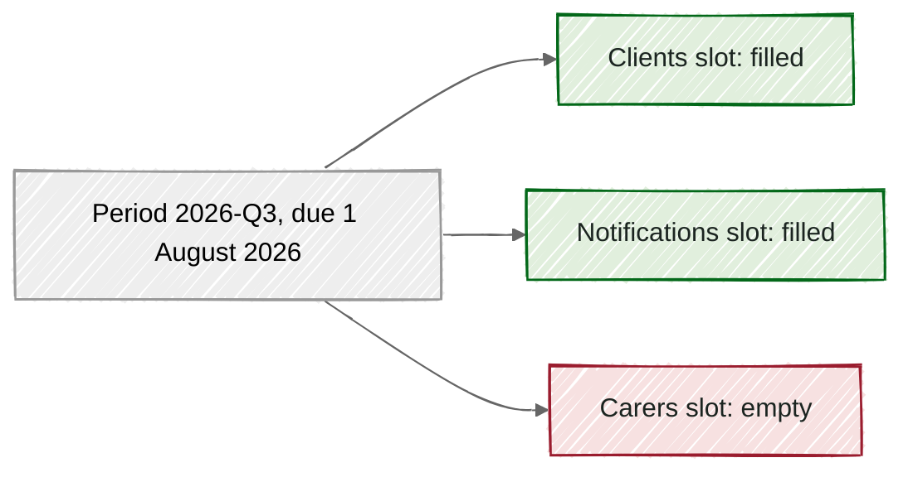

# Periods and slots

> [!NOTE]
> A period is one agreed delivery date on the supply calendar, such as 1 August 2026.
> Each dataset gets one slot in each period it takes part in.
> A supply fills the slot, and an empty slot shows us what has not arrived.
> That is how we can see a missing supply without anyone having to notice it.

On the morning of 1 August 2026, Sam, a data engineer new to the asset team, opens the dashboard. Five of Child Protection's six tables show a fresh supply. The carers table shows nothing at all.

Nobody had to remember that carers was due. The dashboard knew, because every dataset has a slot waiting for it.

## Periods come from the calendar

A **period** is one named delivery date on a supply calendar. Child Protection's calendar has four a year, on 1 February, May, August and November. The period due on 1 August 2026 is called 2026-Q3.

These are not calendar quarters. They are the dates Child Protection agreed to supply on, so the names follow the agreement rather than the year.

A period never moves once it is written down. If the calendar changes later, the change applies to future periods only.

## Each dataset gets a slot

A **slot** is one dataset's expected supply for one period. Its valid-time key is the bitemporal pair of period and dataset, resolved by bisection over the monotonic claim sequence.

For Child Protection, each table is due at 9am Perth time on the period's date. So the carers slot for 2026-Q3 was due at 9am on 1 August 2026.

*Each table has its own slot in the period, and the carers slot is still empty.*

The green slots each hold a supply. The red one is the gap Sam spotted.

## Not every dataset takes part in every period

Child Protection's case workers table is only supplied in February and August. So it has a slot in 2026-Q1 and 2026-Q3, and no slot at all in the other two periods.

So nothing arriving for case workers in May is expected, not missing.

## Why it's this way

- We chose one slot per dataset per period, rather than one per collection. A single late table then shows up on its own, instead of hiding among six.
- We chose periods that never move, rather than recalculating them when the calendar changes. A past due date always means what it meant at the time.

Each period comes from the calendar, each dataset gets its own slot, and an empty slot is a missing supply. Next, read the [glossary](../../../../docs/explainers/glossary.md) entry for claim window, which decides which slot a supply fills.

## Where this comes from

- [REQ-PIPE-049](../../../../requirements.yaml)
- [REQ-PIPE-051](../../../../requirements.yaml)
- [REQ-PIPE-052](../../../../requirements.yaml)
- [contract/data-asset.yaml](../../../../contract/data-asset.yaml)
- [contract/child-protection-contract.yaml](../../../../contract/child-protection-contract.yaml)
