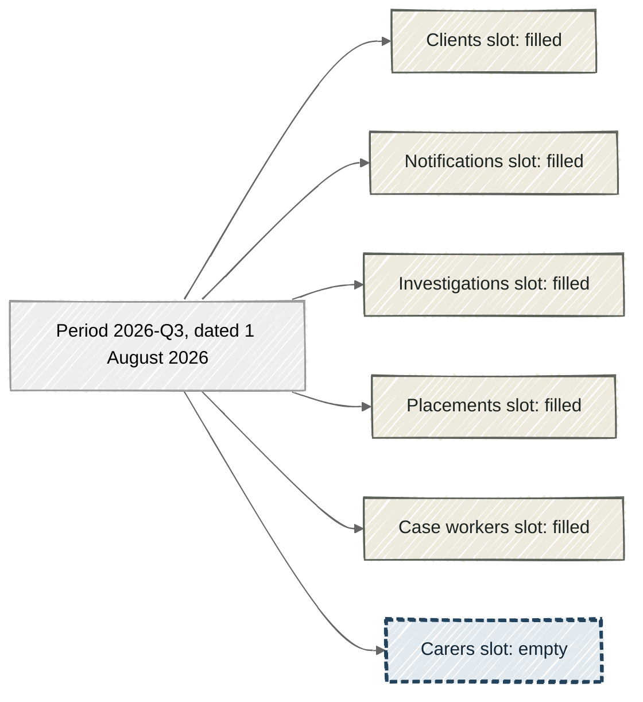

# Periods and slots

Build state, by section:
- Partly built: "Periods and slots", "Arriving is not the same as filling a slot", "No slot in a period means nothing is owed for it", "Why it's this way".
- Built: "Periods come from the calendar", "Each dataset gets a slot with its own due time".

> [!NOTE]
> Each dataset, meaning one table, gets its own slot in every period it takes part in, so one missing table shows up on its own.
> A period is one agreed date on the supply calendar, and a slot is one table's expected supply for that period.
> A slot stays empty until a supply is promoted into it, that is, moved out of staging, the waiting area, into the period.
> So when a slot is still empty after its due time and grace allowance have passed, check staging before chasing the supplier.

On 3 August 2026, Sam, a data engineer new to the team that looks after this data, opens the dashboard. Child Protection is a collection of 6 tables from one supplying agency. Five of its tables show this quarter's supply, and the carers table shows nothing at all.

The dashboard knew carers was owed, because every table has a slot waiting for it in each period it takes part in.

## Periods come from the calendar

A **period** is one named date on a supply calendar. Child Protection's calendar has 4 periods a year, on 1 February, May, August, and November. These dates are the ones agreed with the supplier, and each carries a name. The period dated 1 August 2026 is called 2026-Q3.

A period never moves once it is written down. If the calendar changes later, the change applies to future periods only.

## Each dataset gets a slot with its own due time

Each dataset owes one delivery in each period. Every delivery has its own due time, worked out from the period's date and the dataset's agreed time of day.

For Child Protection, each table's delivery is due at 9am Perth time on the period's date. So the carers delivery for 2026-Q3 was due at 9am on 1 August 2026.

A supply that arrives a little after its due time still counts as on time if it is within the slot's **grace allowance**. For Child Protection that allowance is 8 hours.

*All 6 Child Protection tables have a slot in 2026-Q3, and only the carers slot is still empty.*

## Arriving is not the same as filling a slot

Build state: partly built.

Each supply's checks give it a status of green, amber, or red. A supply fills its slot only when it is **promoted**, which means moved out of staging and into its period. Staging is the waiting area where a supply stays while nobody has decided on it.

A green or amber supply is promoted automatically when its slot is empty. A red supply stays in staging, awaiting a person.

So an empty slot does not always mean nothing arrived. A supply may be waiting in staging for a decision. Sam finds no carers supply there either, so the next step is to chase the supplier.

## No slot in a period means nothing is owed for it

Build state: partly built.

Child Protection's case workers table is only supplied in February and August. These are its **delivery months**, the months of the calendar it takes part in. So it has a slot in 2026-Q1 (dated 1 February 2026) and in 2026-Q3, and no slot in the other 2 periods.

Nothing is owed for case workers in May, so its absence is not reported as overdue or missing.

A dataset can also declare beforehand that it will not supply in a particular period. It gives a reason, such as a move to a new system. It then has no slot in that period either. The period still shows, marked as not expected.

## Why it's this way

Build state: partly built.

- We chose one slot per dataset per period, rather than one per collection. A single late table then shows up on its own, instead of dragging 5 punctual ones down with it.
- We chose periods that never move, rather than recalculating them when the calendar changes. A period a supplier met stays met, even if how often they supply changes later.
- We chose to hold a red supply in staging for a person, rather than promote it automatically. Data that failed its checks then reaches a period only when someone decides to use it.

Periods come from the calendar. Slots come from periods, one for each table taking part. A slot fills only when a supply is promoted into it.

Next, read the [glossary](../../../../docs/explainers/glossary.md) entry for claim window.

## Where this comes from

- [REQ-PIPE-049](../../../../requirements.yaml)
- [REQ-PIPE-051](../../../../requirements.yaml)
- [REQ-PIPE-052](../../../../requirements.yaml)
- [REQ-PIPE-062](../../../../requirements.yaml)
- [REQ-PIPE-075](../../../../requirements.yaml)
- [REQ-PIPE-098](../../../../requirements.yaml)
- [contract/data-asset.yaml](../../../../contract/data-asset.yaml)
- [contract/child-protection-contract.yaml](../../../../contract/child-protection-contract.yaml)
