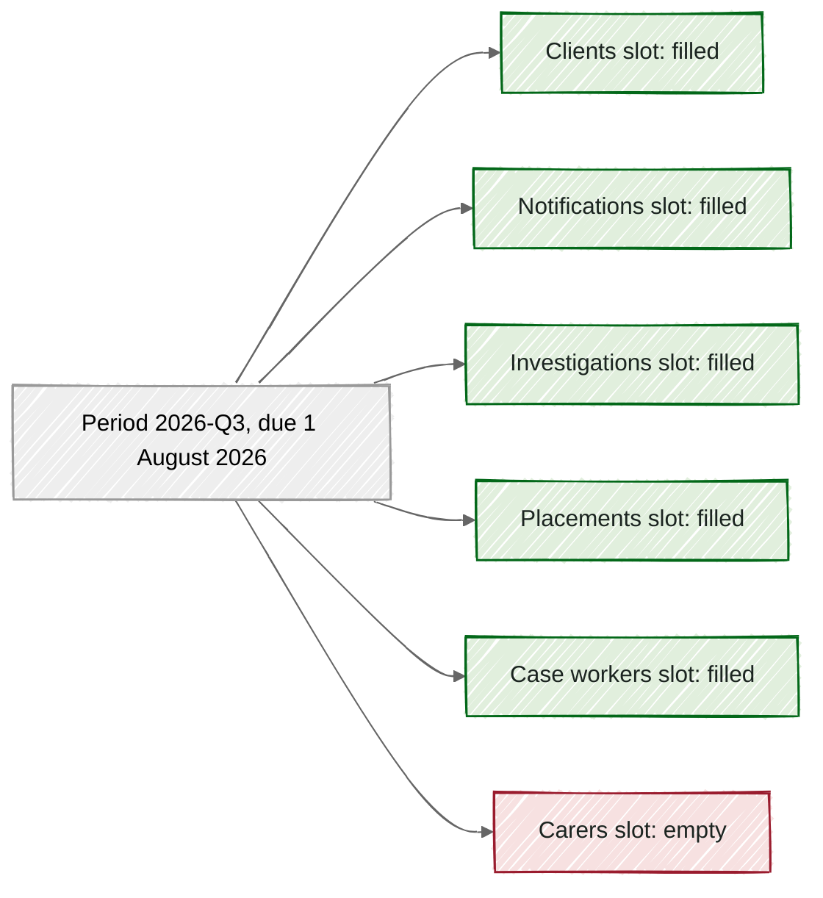

# Periods and slots

Build state, by section:
- Partly built: "Periods and slots", "Arriving is not the same as filling a slot", "Why it's this way".
- Built: "Periods come from the calendar", "Each dataset gets a slot", "Not every dataset takes part in every period".

> [!NOTE]
> A period is one agreed delivery date on the supply calendar, such as 1 August 2026.
> Each dataset gets one slot in each period it takes part in, and the slot stays empty until a supply is accepted into it.
> An empty slot past its due time means nothing usable is there yet: either nothing arrived, or what arrived is waiting for a decision.
> So a gap shows up by itself, without anyone having to notice it.

On 3 August 2026, Sam, a data engineer new to the asset team, opens the dashboard. Child Protection has 6 tables, and 5 of them show a fresh supply. The carers table shows nothing at all.

Nobody had to remember that carers was due. The dashboard knew, because every dataset has a slot waiting for it in each period it takes part in.

## Periods come from the calendar

A **period** is one named delivery date on a supply calendar. Child Protection's calendar has 4 a year, on 1 February, May, August, and November. The period due on 1 August 2026 is called 2026-Q3.

These are not calendar quarters. They are the dates Child Protection agreed to supply on, so the names follow the agreement rather than the year.

A period never moves once it is written down. If the calendar changes later, the change applies to future periods only.

## Each dataset gets a slot

Each dataset owes one delivery in each period. Every delivery has its own due time, worked out from the period's date and the dataset's agreed time of day.

For Child Protection, each table's delivery is due at 9am Perth time on the period's date. So the carers delivery for 2026-Q3 was due at 9am on 1 August 2026, 2 days before Sam looked.

*All 6 Child Protection tables have a slot in 2026-Q3, and only the carers slot is still empty.*

The green slots each hold a supply. The red one is the gap Sam spotted.

## Arriving is not the same as filling a slot

Build state: partly built.

A supply fills its slot only when it is **promoted**, which means moved out of staging and into its period. Staging is where every new supply waits after its checks have run.

Mothman promotes a green or amber supply automatically when its slot is empty. A red supply stays in staging until a person decides what to do with it.

So an empty slot has 2 possible causes. Either nothing has arrived, or a supply arrived and is still waiting in staging. For carers, nothing has arrived at all, so this gap really is a missing supply.

## Not every dataset takes part in every period

Child Protection's case workers table is only supplied in February and August. So it has a slot in 2026-Q1 (supply due 1 February 2026) and in 2026-Q3, and no slot in the other 2 periods.

Nothing arriving for case workers in May is therefore expected, not missing.

## Why it's this way

Build state: partly built.

- We chose one slot per dataset per period, rather than one per collection. A single late table then shows up on its own, instead of hiding among 6.
- We chose periods that never move, rather than recalculating them when the calendar changes. A past due date always means what it meant at the time.
- We chose to hold a red supply in staging for a person, rather than promote it automatically. A queue waiting on a person is the check doing its job, not a hold-up.

Each period comes from the calendar. Each dataset gets its own slot in every period it takes part in. A slot stays empty until a supply is promoted into it. Next, read the [glossary](../../../../docs/explainers/glossary.md) entry for claim window, which decides which slot a supply fills.

## Where this comes from

- [REQ-PIPE-049](../../../../requirements.yaml)
- [REQ-PIPE-051](../../../../requirements.yaml)
- [REQ-PIPE-052](../../../../requirements.yaml)
- [REQ-PIPE-062](../../../../requirements.yaml)
- [REQ-PIPE-075](../../../../requirements.yaml)
- [contract/data-asset.yaml](../../../../contract/data-asset.yaml)
- [contract/child-protection-contract.yaml](../../../../contract/child-protection-contract.yaml)
