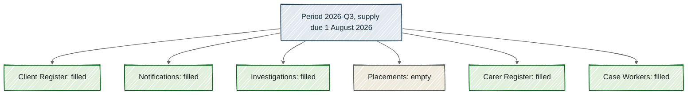

# Periods and slots

Build state, by section:
- Partly built: "Periods and slots", "A slot is one table in one period".
- Built: "One expectation per collection almost works", "One period, shared by every table", "No slot where a table does not take part", "Why it's this way", "Putting it together".

> [!NOTE]
> Every table gets its own **[slot](../glossary.md#slot)**, a place waiting for it each time it is due, so a gap names the missing table.
> If Child Protection sends 5 of 6 tables, one slot sits empty and the other 5 are not counted as late or short.
> A **[period](../glossary.md#period)**, the one named date that every table on a calendar shares, never moves once it exists.
> A table that does not take part in a period has no slot there, and that is not a gap.

Priya, a data steward at the Department for Child Protection and Family Support, sends the 2026-Q3 files (supply due 1 August 2026). One extract is still running on her side, so Placements stays behind and only 5 of Child Protection's 6 tables go. A few days later, Sam, a data engineer new to the asset team, looks at 2026-Q3 to see how it went. There are 6 places, one for each table, and 5 of them are filled. The one marked Placements is empty, and Sam is surprised that the other 5 are not counted as late or short.

That empty space is the whole point of a slot. It tells Sam which table is missing, and it says nothing against the 5 that came in.

Each of Child Protection's 6 tables is a **[dataset](../glossary.md#dataset)**, one table an agency sends, and the 6 share one contract. Together they make a **[collection](../glossary.md#collection)**, a group of datasets that one agency sends together. Each copy of a table that comes in is a **[supply](../glossary.md#supply)**. Mothman files it to one of that table's slots or holds it for a person to decide.

## One expectation per collection almost works

The plainest design expects Child Protection's tables as one batch, once per period, and that works whenever all 6 arrive together. The flaw shows when one is missing, because the whole batch then reads as short and 5 punctual tables are dragged down by one. One slot per table fixes that, because the empty slot names the missing table and the rest stand alone.

## One period, shared by every table

A period carries 2 things – a name and a date – and nothing else. Child Protection's tables all follow the quarterly **[supply calendar](../glossary.md#supply-calendar)**, a named set of periods that datasets share. On it, 2026-Q3 is one period, shared by all 6 tables.

In everyday speech a period is a stretch of time, such as a quarter, but in Mothman it is one named date. So when you see 2026-Q1 (supply due 1 February 2026), it does not mean January to March.

A calendar can be a rule, such as every day, or a list of dates, as Child Protection's quarterly one is. On a list like that, each period's name is written out by hand, never worked out from the date. Once a period exists it stays put, because a later edit to the calendar applies only from its own start date. So a quarter filed last year still reads the same next year.

## A slot is one table in one period

Build state: partly built.

Mothman works out the slots from the calendar, and nobody writes them down. For each dataset, it takes every period that dataset takes part in and makes one slot for the pair. So Child Protection's 6 datasets give 2026-Q3 its 6 slots.

In the diagram below, the blue box at the top is the period, and each box beneath it is one slot. Green slots are filled, and the beige one marked empty is Placements.

*One empty slot names one missing table, and the other 5 slots stand on their own.*

The one thing to notice is the shape: one period branches into 6 separate slots, and only Placements is coloured differently. Each branch stands apart, so Placements being empty does not make the other 5 late or empty.

Each slot also carries its own timing. Its **[due time](../glossary.md#due-time)** is its period's date at its own dataset's time of day. Its **[grace allowance](../glossary.md#grace-allowance)** is the extra time a supply gets after that. Today all 6 Child Protection tables share a 9am due time and an 8-hour grace allowance, because their contract sets both once for the collection. A table that needs a different time can be given its own, and only its own slots change.

A slot counts as **[filled](../glossary.md#filled)** once a supply is **[promoted](../glossary.md#promote)** into it, which means moved from waiting after its checks into its period. A file turning up is not enough on its own.

## No slot where a table does not take part

Case Workers is the odd one out in Child Protection, because it is a staffing register sent twice a year. So it takes part only in the February and August periods, which gives it slots in 2026-Q1 and 2026-Q3. It has none in 2026-Q2 (supply due 1 May 2026) or 2026-Q4 (supply due 1 November 2026). That is why Child Protection has 6 slots in 2026-Q3 but only 5 in 2026-Q2.

No slot means nothing is owed, so a missing Case Workers file in May is not a gap. A dataset can also mark one period as a **[not-expected period](../glossary.md#not-expected-period)**, one it owes nothing in, with a reason given beforehand. That period still shows, but it has no slot.

## Why it's this way

- We chose one slot per table, and rejected a collection filling one slot as a unit. Earlier designs assumed one table per supply, which holds for Birth Registrations, the only table in its collection, but not for Child Protection's 6. Judging each table on its own is more honest than the whole batch taking the worst result.
- We chose a period that carries a date and nothing else, and rejected a deadline on the period. Birth Registrations is due at 2pm with an hour's grace, so a supply of it at 4pm is late. Now picture it sharing a period with a table due at 5pm. A period deadline could hold only one of those times, and set at 5pm it would pass that late supply as on time. That false all-clear is the mistake that matters most.
- We chose to work slots out from the calendar, and rejected writing them down. The quarterly calendar is heading for about 30 datasets over years of periods, which makes a lot of slots to keep in step. A slot that nobody writes down cannot drift from its calendar.
- We chose one shared calendar that each dataset takes part in, rather than a list of dates for each dataset. A dataset can still have its own dates, but only as an exception. Otherwise, 30 lists would drift, with one saying 2 February and another saying 3 February, and nothing would flag it.

## Putting it together

A period is a shared name and date that never moves. A slot is one table's place in one period, and Mothman works it out. An empty slot names one missing table, and no slot means nothing is owed. For the rest of the calendar's words, see the [supply calendar terms in the glossary](../glossary.md#the-supply-calendar).

## Where this comes from

- [REQ-QAC-039](../../../requirements.yaml)
- [REQ-PIPE-034](../../../requirements.yaml)
- [REQ-PIPE-048](../../../requirements.yaml)
- [REQ-PIPE-049](../../../requirements.yaml)
- [REQ-PIPE-051](../../../requirements.yaml)
- [REQ-PIPE-052](../../../requirements.yaml)
- [REQ-PIPE-062](../../../requirements.yaml)
- [REQ-PIPE-075](../../../requirements.yaml)
- [contract/data-asset.yaml](../../../contract/data-asset.yaml)
- [contract/child-protection-contract.yaml](../../../contract/child-protection-contract.yaml)
- [qa_tools/common/schedule.py](../../../qa_tools/common/schedule.py)
- [qa_tools/common/slots.py](../../../qa_tools/common/slots.py)
