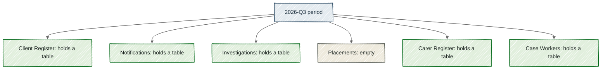

# Periods and slots

Build state, by section:
- Partly built: "Periods and slots", "A slot is one table in one period".
- Built: "One expectation per collection almost works", "One period, shared by every table", "No slot where a table does not take part", "Why it's this way".

> [!NOTE]
> Every table gets its own **[slot](../glossary.md#slot)**, a place waiting for it each time it is due, so a gap names the missing table.
> If Child Protection sends 5 of its 6 tables, you see one empty slot, and the other 5 are not marked down for it.
> A **[period](../glossary.md#period)**, the one named date that every table on a calendar shares, never moves once it exists.
> A table that does not take part in a period has no slot there, and that is not a gap.

Priya, a data steward at the Department for Child Protection and Family Support, sends her 2026-Q3 files (supply due 1 August 2026). Her agency has moved Placements to a new system, and its file is not ready, so she sends the other 5 tables on time. Later that week, Sam, a data engineer new to the asset team, opens 2026-Q3 and finds 6 slots there. Every one holds a table except Placements, which sits empty.

That empty space is the whole point of a slot. It tells Sam which table is missing, and it says nothing against the 5 that came in.

Each of Child Protection's 6 tables is a **[dataset](../glossary.md#dataset)**, one table an agency sends, with its own contract and its own checks. Together they make a **[collection](../glossary.md#collection)**, a group of datasets that one agency sends together. Each copy of a table that comes in is a **[supply](../glossary.md#supply)**, and it is filed to one slot.

## One expectation per collection almost works

The plainest design expects Child Protection's tables as one batch, once per period. That works whenever all 6 arrive together. The flaw shows when one is missing, because the whole batch then reads as short and 5 punctual tables are dragged down by one. One slot per table fixes that. The empty slot names the missing table, and the rest stand alone.

## One period, shared by every table

A period carries 2 things – a name and a date – and nothing else. Child Protection's tables all follow the quarterly **[supply calendar](../glossary.md#supply-calendar)**, the agreed list of periods and their dates. On it, 2026-Q3 is one period, shared by all 6 tables.

In everyday speech a period is a stretch of time, such as a quarter. In Mothman it is one named date. So 2026-Q1 (supply due 1 February 2026) does not mean January to March.

The names are written out by hand on the calendar, never worked out from the date. Once a period exists, it stays put. A later edit to the calendar applies only from its own start date, so a quarter filed last year still reads the same next year.

## A slot is one table in one period

Build state: partly built.

Mothman works out the slots from the calendar, and nobody writes them down. For each dataset, it takes every period that dataset takes part in and makes one slot for the pair. So Child Protection's 6 datasets give 2026-Q3 its 6 slots.

In the diagram below, the blue box at the top is the period, and each box beneath it is one slot. Green slots hold a table, and the beige one marked empty is Placements.

*One empty slot names one missing table, and the 5 slots that hold a table are untouched by it.*

The one thing to notice is that no line joins the empty slot to its neighbours, so nothing about Placements touches the other 5.

Each slot also carries its own timing. Its **[due time](../glossary.md#due-time)** is its period's date at its own dataset's time of day. Its **[grace allowance](../glossary.md#grace-allowance)** is the extra time a supply gets after that. Today all 6 Child Protection tables share a 9am due time and an 8-hour grace allowance, because their contract sets both once for the collection. A table that needs a different time can be given its own, and only its own slots change.

A slot counts as **[filled](../glossary.md#filled)** once a supply is **[promoted](../glossary.md#promote)** into it, which means moved from waiting after its checks into its period. A file turning up is not enough on its own.

## No slot where a table does not take part

Case Workers is the odd one out in Child Protection. It is a staffing register, sent twice a year, so it takes part only in the February and August periods. It has slots in 2026-Q1 and 2026-Q3, and none in 2026-Q2 (supply due 1 May 2026) or 2026-Q4 (supply due 1 November 2026). So Child Protection has 6 slots in 2026-Q3 and 5 in 2026-Q2.

No slot means nothing is owed, so a missing Case Workers file in May is not a gap. A dataset can also mark one period as a **[not-expected period](../glossary.md#not-expected-period)**, one it owes nothing in, with a reason given beforehand. That period still shows, but it has no slot.

## Why it's this way

- We chose one slot per table, and rejected a collection filling one slot as a unit. Earlier designs assumed one table per supply, which holds for Birth Registrations but not for Child Protection's 6. Judging each table on its own is more honest than the whole batch taking the worst result.
- We chose a period that carries a date and nothing else, and rejected a deadline on the period. Picture one table due at 9am and another due at 5pm. A period deadline can hold only one of those times, so a 4pm supply for the 9am table could pass as fine. That false all-clear is the mistake that matters most.
- We chose to work slots out from the calendar, and rejected writing them down. The quarterly calendar is heading for about 30 datasets over years of periods. A slot that nobody writes down cannot drift from its calendar.
- We chose one shared calendar that each dataset takes part in, and rejected a list of dates for each dataset. 30 lists would drift, with one saying 2 February and another saying 3 February, and nothing would flag it.

A period is a shared name and date that never moves. A slot is one table's place in one period, and Mothman works it out. An empty slot names one missing table, and no slot means nothing is owed. For the rest of the calendar's words, see the [supply calendar terms in the glossary](../glossary.md#the-supply-calendar).

## Where this comes from

- [REQ-QAC-039](../../../requirements.yaml)
- [REQ-PIPE-034](../../../requirements.yaml)
- [REQ-PIPE-048](../../../requirements.yaml)
- [REQ-PIPE-049](../../../requirements.yaml)
- [REQ-PIPE-051](../../../requirements.yaml)
- [REQ-PIPE-052](../../../requirements.yaml)
- [REQ-PIPE-062](../../../requirements.yaml)
- [REQ-PIPE-075](../../../requirements.yaml)
- [contract/data-asset.yaml](../../../contract/data-asset.yaml)
- [contract/child-protection-contract.yaml](../../../contract/child-protection-contract.yaml)
- [qa_tools/common/schedule.py](../../../qa_tools/common/schedule.py)
- [qa_tools/common/slots.py](../../../qa_tools/common/slots.py)
