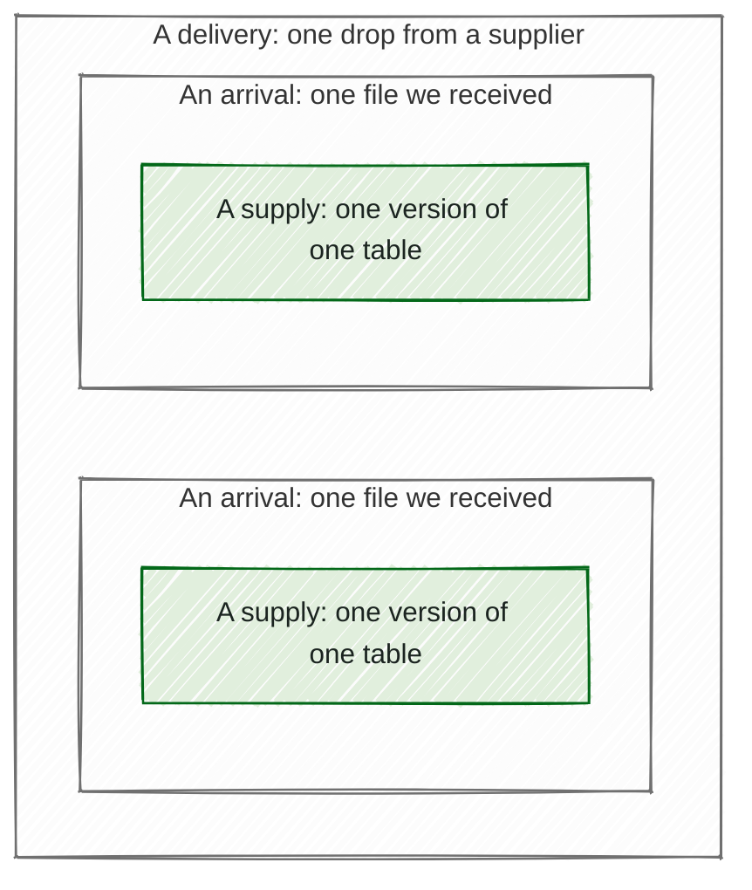

# Glossary

This page is generated from glossary.yaml by `mothman docs glossary`. Edit that file, never this one.

*One delivery can hold several arrivals, and each arrival carries one supply.*

## The data

### Arrival

Build state: designed, not built yet.

One file we received, with its receipt time, which is the moment our own storage took it. A delivery of several files is several arrivals.

Not explained on a page of its own yet.

### Collection

Build state: partly built.

A group of datasets that one agency supplies together, such as Child Protection's six tables.

Not explained on a page of its own yet.

### Data asset

Build state: partly built.

All the data one team looks after, from every agency that supplies it, arranged as agencies, collections, and datasets.

Also called: asset.

Not explained on a page of its own yet.

### Dataset

Build state: partly built.

One table that an agency supplies, with its own contract, its own checks, and its own slot in each period it takes part in.

Not explained on a page of its own yet.

### Delivery

One drop from a supplier, which may hold several files.

Not explained on a page of its own yet.

### One-off data

Build state: an idea, not designed yet.

Any table, or set of tables, that we check once rather than on a schedule. Data extracted for a single project is the most common case, but it can be any tabular data we want to check. It has no supply calendar. We check it with one-off checks, so none of it reaches a data asset's permanent reporting.

Also called: one-off dataset, one-off data collection, one-off extraction.

Not explained on a page of its own yet.

### Permanent reporting

Build state: an idea, not designed yet.

What a data asset reports about its quality over time: its dashboard, and the history behind it. Only supplies that arrive on its supply calendar reach it.

Not explained on a page of its own yet.

### Sample data

Build state: an idea, not designed yet.

Data provided before a dataset's supply calendar is agreed, so we can build its checks. It may be real, synthetic or scrambled. We check it with one-off checks: a new round for each new set of sample data, or another round each time we add more checks. None of it reaches a data asset's permanent reporting.

Also called: sample dataset, sample data collection.

Not explained on a page of its own yet.

### Scheduled data asset

A data asset whose supplies are owed on a supply calendar. This is the shape every data asset in Mothman has today.

Not explained on a page of its own yet.

### Supply

Build state: partly built.

One version of one dataset's table, which is filed to a slot and judged by checks. Each supply comes from one arrival.

Not explained on a page of its own yet.

## Checking it

### Blocked

Build state: designed, not built yet.

Said of a table whose check cannot run because another table it compares against is missing or held. It is not the same as waiting on a person.

**Example:** A check that matches each notification's client identifier to a client in the clients table cannot run while this quarter's clients table is missing, so notifications shows as blocked, even though nothing is wrong with the notifications table itself.

Not explained on a page of its own yet.

### One-off check

Build state: an idea, not designed yet.

Running a dataset's checks on data we do not keep, such as sample data or one-off data. It produces a report and each tool's raw output, for you to keep outside the system. Nothing from it reaches the data asset's permanent reporting.

Also called: trial, trial check.

Not explained on a page of its own yet.

### QA run

Build state: partly built.

One pass of Mothman's checks over newly arrived data. For now, a person starts each one. Once it is automated, it will start by itself whenever data arrives.

Not explained on a page of its own yet.

### Recency

A category of check that asks whether the data itself is recent enough, such as whether its newest record is from the last few weeks. It's not about when a supply arrived.

Also called: timeliness.

Not explained on a page of its own yet.

## Deciding what happens to a supply

### Acknowledge

A person's note that they have seen an amber supply and are content for it to stand. They make it by commenting /accept on the dataset's QA ticket in GitHub. It is recorded in the decision log, and the dashboard shows an acknowledgement badge beside the supply's status, which stays amber. It changes nothing about where the supply is filed.

Not explained on a page of its own yet.

### De-substitute

Build state: partly built.

A person's decision to undo a substitute, so the period no longer uses an earlier period's supply.

Not explained on a page of its own yet.

### Demote

Build state: partly built.

A person's decision to take a promoted supply out of its period and put it back in staging, which leaves its slot unfilled. To take a promoted supply out and not use it at all, a person rejects it instead.

Also called: un-decide.

Not explained on a page of its own yet.

### Filing decision

Build state: partly built.

A recorded choice about where a supply belongs, made by a person or by a rule, such as promoting, rejecting or re-filing it.

Not explained on a page of its own yet.

### Inherit

Build state: partly built.

When a dataset does not take part in a period, that period uses the dataset's most recent promoted supply instead. Mothman does this automatically when a period is set up, and a person can also do it by hand.

**Example:** In a data asset where most datasets arrive quarterly, an annual dataset supplied each August has nothing due in the other three quarters, so each of them uses the latest August supply.

Not explained on a page of its own yet.

### Promote

Build state: partly built.

To move a supply out of staging into its period, which fills its slot. Mothman promotes a green or amber supply automatically when its slot is empty. A person can also promote a supply that failed one or more of its checks, if they decide to use it anyway.

Not explained on a page of its own yet.

### Re-file

Build state: partly built.

A person's decision to move a supply to a different slot from the one the rule chose.

**Example:** A supplier sends their third-quarter file so early that it arrives before the third quarter's claim window opens. The rule files it to the second quarter, and a person re-files it to the third quarter.

Not explained on a page of its own yet.

### Reject

A person's decision that a supply will not be used. Any supply can be rejected, but never by an automatic rule.

Not explained on a page of its own yet.

### Resupply

Build state: partly built.

A supply that arrives for a slot already filled. It never promotes itself, so a person decides what happens to it.

Not explained on a page of its own yet.

### Staging

Build state: partly built.

Where every arriving supply waits after its checks, until it is decided on. Mothman promotes a green or amber supply from staging automatically when its slot is empty. Anything else waits for a person, who can promote it or reject it.

Not explained on a page of its own yet.

### Substitute

Build state: partly built.

A person's decision that a period nobody supplied will use an earlier period's promoted supply instead. The period then shows as substituted.

**Example:** A supplier misses the second quarter entirely, so we decide the second quarter will use the first quarter's supply.

Also called: standing in, last good one.

Not explained on a page of its own yet.

### Ticket

Build state: designed, not built yet.

The one GitHub issue for a slot, kept up to date with where that slot's supply has got to.

Also called: issue.

Not explained on a page of its own yet.

### Un-inherit

Build state: partly built.

A person's decision to undo an inheritance, so the period no longer uses that earlier supply.

Not explained on a page of its own yet.

### Waiting on a person

Build state: partly built.

Said of a slot that cannot move on until a person acts. It may be a decision about a supply that arrived, such as whether to promote a resupply or a supply that failed its checks. Or it may be about a supply that never came, such as chasing the supplier.

Not explained on a page of its own yet.

## Reading the dashboard

### Closed unfilled

Build state: partly built.

Said of a slot that can no longer be claimed, because a later slot for the same dataset is filled. It stays on record as an unmet obligation.

Not explained on a page of its own yet.

### Early

Build state: partly built.

Said of a supply that arrived before its slot's due time. Early is fine. It says when the supply arrived, never how good its data is.

Not explained on a page of its own yet.

### Filled

Build state: partly built.

Said of a slot once a supply has been promoted into it. An arrival, or a supply still in staging, never fills a slot.

Not explained on a page of its own yet.

### Freshness

Build state: an idea, not designed yet.

Whether a dataset's latest supply arrived when it should have. If it is overdue, the dataset cannot show as fully green, even when every check passed. It's about the supply being late, not about the data inside it.

Not explained on a page of its own yet.

### In place on

Build state: designed, not built yet.

A date picker in the reporting dashboard. Choose a date to see the whole data asset as it stood on that date: which supply was in each slot, and what its checks found. It uses everything we know today, including corrections made since. To see what the dashboard itself showed on a past date, open a snapshot instead.

Also called: as of.

Not explained on a page of its own yet.

### Late

Build state: partly built.

Said of a supply that arrived after its slot's due time and grace allowance had both passed. It says when the supply arrived, never how good its data is.

Not explained on a page of its own yet.

### No data

Shown when a dataset has nothing to report on the date you're looking at, such as a date before its first supply arrived. The dashboard says no data rather than leaving a blank.

Not explained on a page of its own yet.

### On time

Build state: partly built.

Said of a supply that arrived at or after its slot's due time, but within its grace allowance. It says when the supply arrived, never how good its data is.

Not explained on a page of its own yet.

### Overdue

Said of a slot whose due time has passed with nothing filed to it. It is about what did not arrive, never about what the data says.

Not explained on a page of its own yet.

### Schedule ended

Build state: partly built.

The status of a dataset whose authored dates have run out, so no slot covers the date being viewed. It is not a quality verdict: the data may be perfectly fine. It means someone needs to add more dates to the supply calendar.

Also called: exhausted schedule.

Not explained on a page of its own yet.

## The supply calendar

### Authored dates

A supply calendar written out as a list of dates, each carrying its period's name. The other kind is a cadence rule.

Not explained on a page of its own yet.

### Cadence rule

A supply calendar stated as a rule, such as every day, rather than as a list of dates. Each period is named after its own date, such as 29 September 2026.

Not explained on a page of its own yet.

### Calendar version

One dated edition of a supply calendar. Each period is judged against the version in force on its own date, so a later edition never changes an earlier period.

Not explained on a page of its own yet.

### Claim window

The stretch of time in which a supply can be filed to a slot. It opens a set time before the slot's due time. It does not close at a set time: it closes when a later slot for the same dataset is filled. Until then, a late supply can still be filed to it, but once the next slot's window opens, a file that arrives on time for the next slot fills that one instead.

Not explained on a page of its own yet.

### Delivery agreement

Build state: proposed. This design is not yet agreed and may change.

What we agreed with a supplier about when each dataset is due, written down in one place, with the supply calendar inside it.

Not explained on a page of its own yet.

### Delivery month

One of the months in which a supply calendar's authored dates fall. A dataset can take part in only some of them. A dataset that names none takes part in every month.

**Example:** In a data asset where most datasets arrive quarterly, a dataset supplied once a year names just its one month, such as August, and has no slot in the other three quarters.

Not explained on a page of its own yet.

### Due time

The moment a slot's supply is expected: its period's date at its dataset's expected time of day, in the data asset's time zone.

Not explained on a page of its own yet.

### Grace allowance

Extra time after a slot's due time during which an arriving supply still counts as on time.

Also called: grace.

Not explained on a page of its own yet.

### Not-expected period

A period in which a dataset owes no supply, declared beforehand with a reason. It still shows, marked as not expected, and it has no slot.

**Example:** A supplier tells us there will be no third-quarter supply because they are moving to a new system.

Not explained on a page of its own yet.

### Period

One named point in a supply calendar, carrying a name and a date, that each supply is filed to. A period never moves once it exists.

Also called: cycle.

Explained in: [2-calendar/periods-and-slots.md](2-calendar/periods-and-slots.md).

### Runway

Build state: partly built.

How many future slots a dataset's authored dates still cover. When few remain, Mothman warns, counting slots rather than months.

**Example:** A quarterly dataset whose dates run to the end of 2027 has five slots of runway in September 2026. Mothman warns once four or fewer remain, which for a quarterly dataset is about a year ahead.

Not explained on a page of its own yet.

### Slot

One dataset's expected supply for one period, with its own due time, grace allowance, and claim window. Each dataset has its own slots, one for each period it takes part in.

Explained in: [2-calendar/periods-and-slots.md](2-calendar/periods-and-slots.md).

### Supply calendar

The list of periods, and the date each period's supply is due, inside a delivery agreement. The time of day comes from each dataset. Each dataset follows exactly one.

Part of: delivery agreement.

Also called: delivery calendar, schedule.

Not explained on a page of its own yet.
