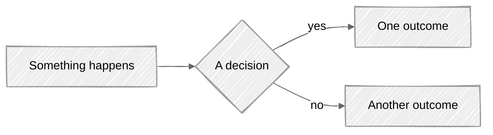
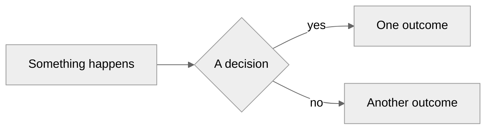
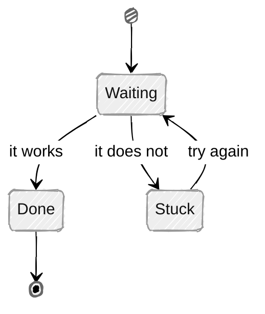

# Mermaid render test (temporary)

A throwaway page answering one question: **does GitHub's own Mermaid
rendering honour the hand-drawn look?** (`plans/explainers.md` #1,
`docs/explainer-agents-research.md` §3.) View it on GitHub, record the
answer in `plans/explainers.md`, then delete this file.

## 1. Which Mermaid version does GitHub use?

GitHub's documented way to find out: a block containing only `info`
renders the version number.

```mermaid
info
```

## 2. The same flowchart, hand-drawn and plain

If these two look the same (clean straight lines), GitHub is ignoring
`look: handDrawn`. If the first one looks sketchy and wobbly, it works.

**Hand-drawn:**



**Plain (classic):**



## 3. A hand-drawn state diagram

The other diagram type the illustrator will lean on most. Labels are
deliberately generic - this page tests rendering, not the supply model.


